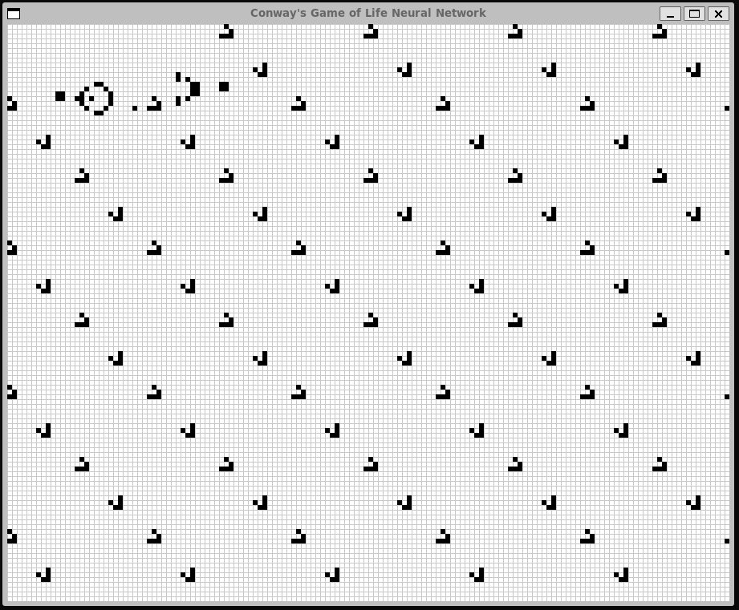

# Game of life as a neural network
A passing thought came to my mind - the rules of Game of life are essentially a 3x3 convolution filter.

That means I can train a really simple neural network to advance a game of life board by one step.
Furthermore - since convolution is the only thing going on, I can train the model on tiny boards and the network will work on boards of any size - and on the GPU!

The only thing that was not easy is making the network run on a toroid board - meaning that the board wraps around itself. you can look at the `call` method in [network.py](network.py) to see how I did that


# Usage
I included a requirements.txt file, it has everything that's needed and some things that are not needed, if you install it you'll have everything you need:
```bash
pip install -r requirements.txt
```

To see a glider gun running on the model with pre-trained weights, just run main.py:
```bash
python main.py
```

To train the model yourself use the `-t` or `--train` option:
```bash
python main.py -t
```

You can save the weights using `-s` or `--save`:
```bash
python main.py -t -s
```

If you want to save or load the weights to different file use the `-w` or `--model-weights` option.

This is how you save weights:
```bash
python main.py -t -s -w my_weights.ckpt
```

and this is how you run the model with your saved weights:
```bash
python main.py -w my_weights.ckpt
```
# The model
The model structure is very simple - it's a 3x3 convolutional layer followed by a 1x1 convolutional layer.
It's implemented using the subclass API of TensorFlow in order to implement to wraparound behaviour.

# Play with it!
The included model trains on a 5000 5x5 random boards, the model has 32 filters and is trained for 30 epochs

Play with the constants on the top network.py to see how low you can go with the filters and still get a working result.
The smallest model I got to work consistently had 5 filters - but this took a larger training set and a lot more epochs.
The values provided here are with 32 filters, 5000 5x5 training boards and 30 epochs, and this works reliably every time you train the model.
If you get loss of less than 1e-3 game of life will run reliably.

You can also change the function in the end of [main.py](main.py) to do something different with the end results.
It currently downloads a glider gun `.cells` file from [conwaylife.com](https://conwaylife.com/) and displays it on a 150x120 board. But you can do anything you want with it.

# Display
The model works incredibly fast - the display unfortunately doesn't - I used ChatGPT to write 2 displays for game of life, one in QT5 and one in pygame - both of them are a bit slow since they draw the entire board every time. Since writing an efficient game of life display is not very interesting IMO I decided to let it go. Both displays are included, the pygame one is the one that's used.
Initially I used matplotlib to draw everything and the code for that is included in [draw.py](draw.py)
